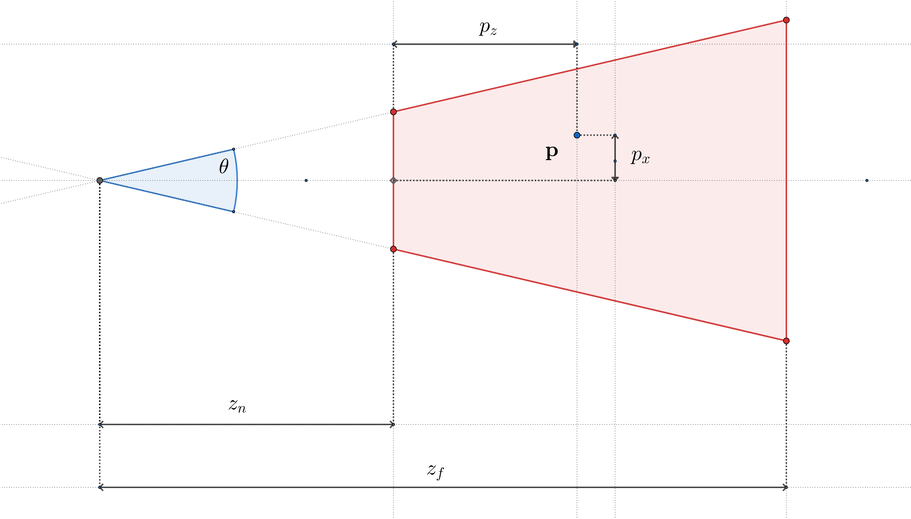

# The Perspective Projection Matrix in WebGL
*Wednesday, March 5, 2025*

We begin by defining some transformation $A\mathrm{\bold{p}}\mapsto\mathrm{\bold{p'}}$ from each
vector $\mathrm{\bold{p}}$ in world space onto its corresponding vector $\mathrm{\bold{p'}}$ in
clip space:
$$

\\[10pt]
\bold{p'} = A\mathrm{\bold{p}}
\\[10pt]
\begin{bmatrix}
p'_x\\
p'_y\\
p'_z\\
1
\end{bmatrix}
=
\begin{bmatrix}
a_{11} & a_{12} & a_{13} & a_{14}\\
a_{21} & a_{22} & a_{23} & a_{24}\\
a_{31} & a_{32} & a_{33} & a_{34}\\
a_{41} & a_{42} & a_{43} & a_{44}\\
\end{bmatrix}
\begin{bmatrix}
p_x\\
p_y\\
p_z\\
1
\end{bmatrix}
$$
We then introduce variables used to define the viewing frustum in world space:
- $\theta$, the angle of the field of view
- $\rho$, the aspect ratio of the viewport
- $z_n$, the Z-position of the near clip plane
- $z_f$, the Z-position of the far clip plane

$$

$$
