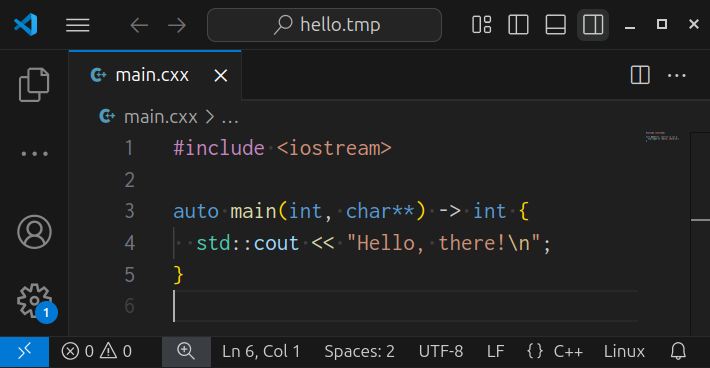

# Favorite Code Fonts
*Wednesday, March 19, 2025*

_Update Apr 10, 2025: New screenshots from VS Code; added Inconsolata; moved Hasklig and Monaspace to Honorable Mentions._

## Anonymous Pro

## Cascadia Code

## CMU Typewriter Text

## Fantasque Sans Mono

## Fira Code

## IBM Plex Mono

## Inconsolata

## JetBrains Mono

## PxPlus IBM VGA 9x16

## Source Code Pro

## Terminus (TTF)
<a href="https://files.ax86.net/terminus-ttf/" title="Terminus (TTF)">.png)</a>

## Honorable Mentions
- <a href="https://github.com/i-tu/Hasklig">Hasklig</a>
- <a href="https://monaspace.githubnext.com/">Monaspace</a>
