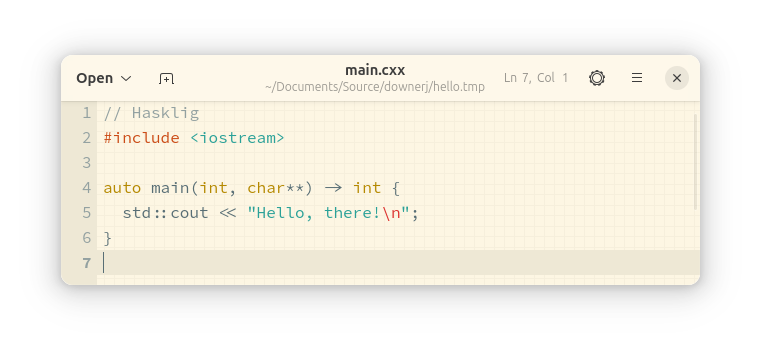

# Favorite Code Fonts
*Wednesday, March 19, 2025*

## Anonymous Pro
<pre style="font-family: 'Anonymous Pro'">
#include &lt;iostream&gt;
auto main(int, char**) -> int {
  std::cout << "Hello, there!\n";
}
</pre>

## Cascadia Code
<pre style="font-family: 'Cascadia Code'">
#include &lt;iostream&gt;
auto main(int, char**) -> int {
  std::cout << "Hello, there!\n";
}
</pre>

<!-- Open Font License -->

<!-- Open Font License -->

<a href="https://files.ax86.net/terminus-ttf/" title="Terminus (TTF)">.png)</a>
